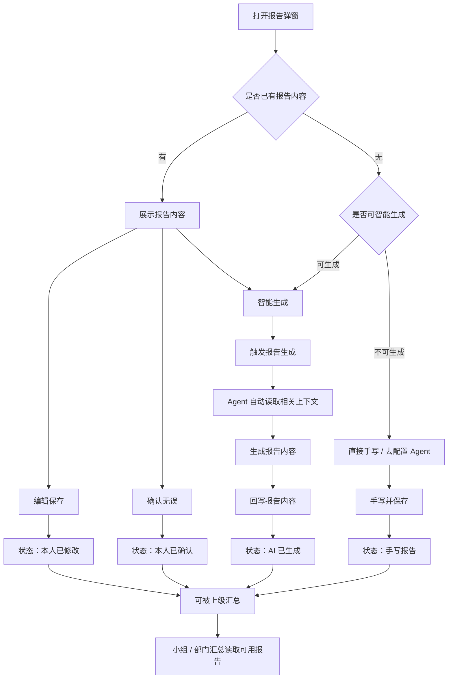
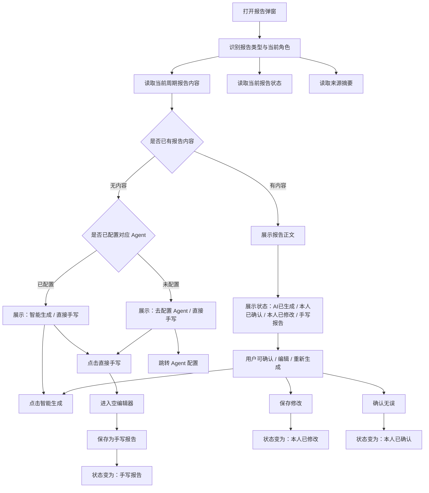
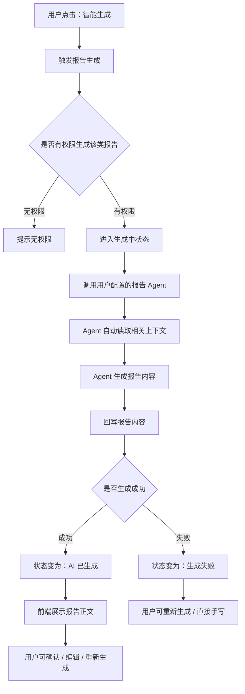
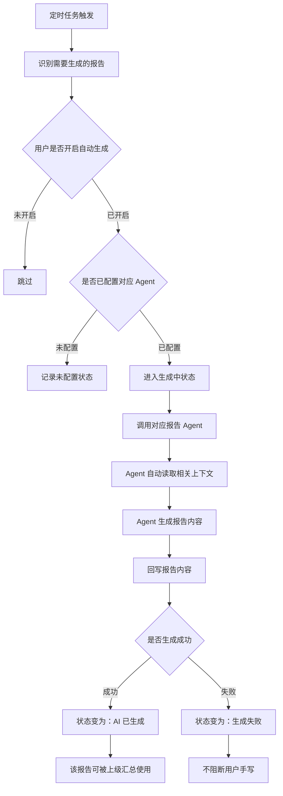
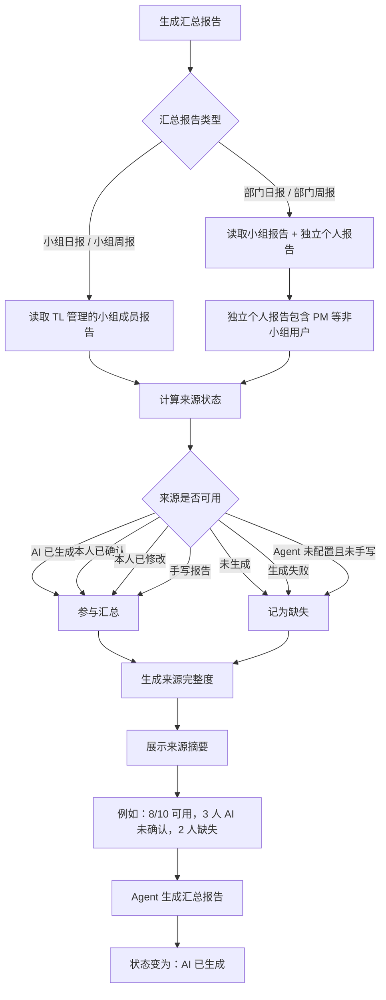
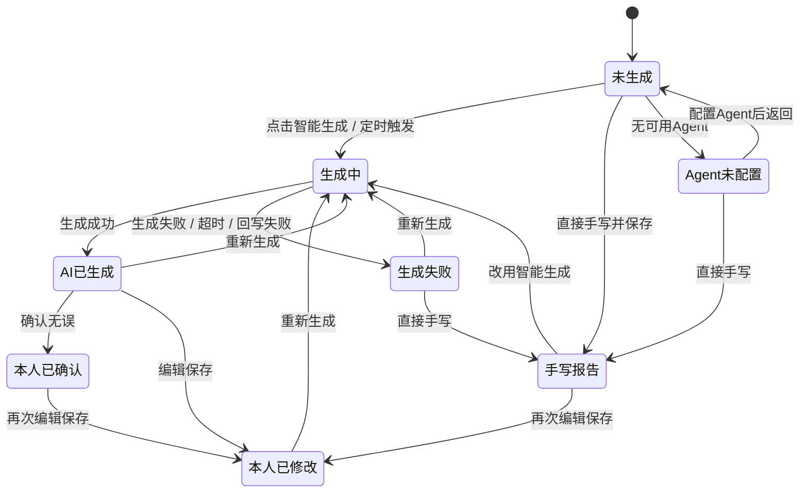
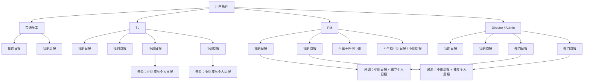

# 日报 / 周报流程图

## 1. 总览流程

## 2. 六类报告弹窗主流程

适用于：

- 我的日报
- 我的周报
- 小组日报
- 小组周报
- 部门日报
- 部门周报

## 3. 手动智能生成流程

用户在报告弹窗内点击“智能生成”后，前端不再选择 session、日报、周报等来源，报告来源由 Agent 根据当前身份与权限自动读取。

## 4. 定时自动生成流程

定时生成与手动生成的产品结果一致，区别只是触发来源不同。

## 5. 小组 / 部门汇总来源流程

汇总报告不等待个人确认，只判断来源是否有可用报告。

## 6. 报告状态流转

可用于上级汇总的状态：

- AI 已生成
- 本人已确认
- 本人已修改
- 手写报告

不可用于上级汇总的状态：

- 未生成
- 生成中
- 生成失败
- Agent 未配置且未手写

## 7. 角色与报告范围关系

## 8. 核心产品结论

1. AI 已生成就是有效报告，不等待用户确认。
2. 确认 / 修改是可信度标记，不是汇总门槛。
3. Agent 自动读取相关上下文，报告弹窗不再选择来源。
4. PM 是独立个人用户，不属于 TL 小组，但可作为部门独立个人来源参与部门汇总。
5. 六类报告弹窗统一为“报告内容管理弹窗”，不再保留 Step 流程、Skill 预设、上传 skill.md、发送对象等旧交互。
