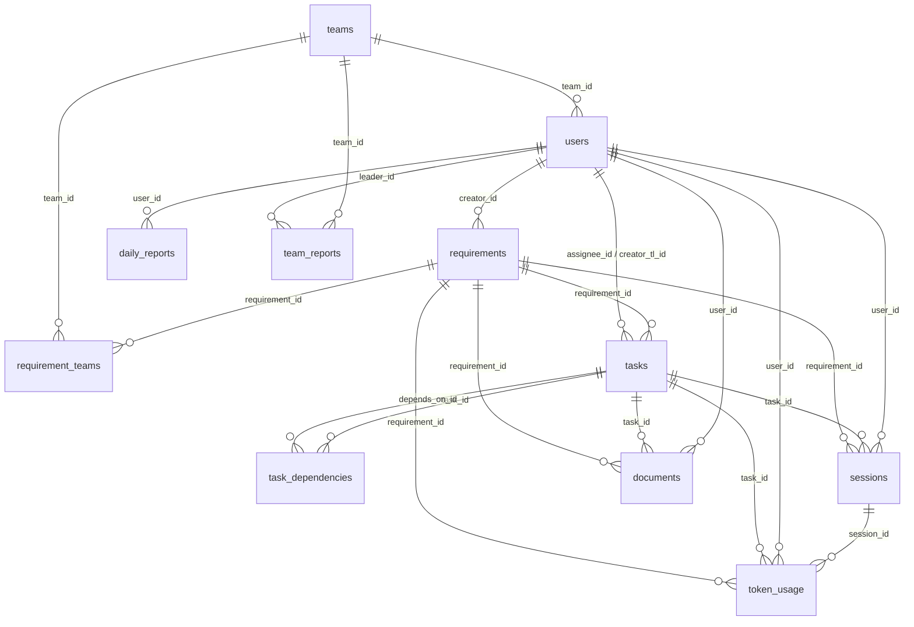

# 旧服务接口与数据库关系

> 文档基线：当前仓库代码（2026-06-24）  
> 用途：作为新需求与重构的对照基线。用户管理模块原则上保留，其他模块需结合新需求重新梳理流程。  
> 说明：本文档只记录接口路径和作用，不展开请求参数、返回结构和实现细节。

## 1. 服务概览

| 服务 | 代码入口 | 接口数 | 作用 |
| --- | --- | ---: | --- |
| 主 API 服务 | `api/main.go` | 44 | 用户、需求、任务、会话、产出物、日报、Token 统计和团队活跃度 |
| 日报生成服务 | `daemon/server_reports.go` | 3 | 供主 API 调用，生成个人和团队日报 |

主 API 业务前缀为 `/api/v1`。除下表明确标记为“公开”的接口外，其余主 API 接口均需要 JWT Bearer Token。

## 2. 主 API 接口

### 2.1 健康检查

| 方法 | 接口 | 访问 | 作用 |
| --- | --- | --- | --- |
| GET | `/health` | 公开 | 检查主 API 进程是否正常运行。 |

### 2.2 认证与用户管理（保留模块）

| 方法 | 接口 | 访问 | 作用 |
| --- | --- | --- | --- |
| POST | `/api/v1/auth/login` | 公开 | 使用工号和密码登录并签发 JWT。 |
| POST | `/api/v1/auth/register` | 公开 | 注册新用户，当前默认创建为普通员工。 |
| GET | `/api/v1/users` | 公开 | 获取用户列表及所属团队。 |
| GET | `/api/v1/auth/me` | 登录 | 获取当前登录用户信息。 |
| GET | `/api/v1/teams` | 登录 | 获取团队列表。 |
| PUT | `/api/v1/admin/users/{id}` | 管理员 | 调整指定用户的角色和/或所属团队。 |
| POST | `/api/v1/admin/users/{id}/reset-password` | 管理员 | 重置指定用户的密码。 |

> 当前实现中 `GET /api/v1/users` 位于认证中间件之外，因此实际是公开接口。用户模块虽然保留，重构时仍应确认这是否符合预期。

### 2.3 需求管理（待重新梳理）

| 方法 | 接口 | 作用 |
| --- | --- | --- |
| GET | `/api/v1/requirements` | 查询当前用户可见的需求列表。 |
| POST | `/api/v1/requirements` | 创建需求，关联负责团队，并生成验收标准。 |
| GET | `/api/v1/requirements/{id}` | 获取单个需求及其关联团队。 |
| PUT | `/api/v1/requirements/{id}` | 更新需求基本信息、状态、优先级、截止日期或关联团队。 |
| GET | `/api/v1/requirements/{id}/ac` | 获取需求验收标准及每条标准的任务完成情况。 |
| POST | `/api/v1/requirements/{id}/regenerate-ac` | 通过 AI 重新生成需求验收标准，限总监、PM 或团队负责人。 |

### 2.4 任务管理（待重新梳理）

| 方法 | 接口 | 作用 |
| --- | --- | --- |
| GET | `/api/v1/tasks` | 查询当前用户可见的任务列表。 |
| POST | `/api/v1/tasks` | 为需求创建任务并指派给团队成员，限团队负责人。 |
| GET | `/api/v1/tasks/{id}` | 获取单个任务、前置依赖和被阻塞关系。 |
| PUT | `/api/v1/tasks/{id}` | 更新任务内容、指派人、状态、优先级、截止日期或验收标准关联。 |
| PUT | `/api/v1/tasks/{id}/status` | 单独更新任务状态，并在完成时重算需求进度。 |
| POST | `/api/v1/tasks/{id}/dependencies` | 为任务新增前置依赖。 |
| DELETE | `/api/v1/tasks/{id}/dependencies/{dep_id}` | 移除任务的指定前置依赖。 |

### 2.5 Claude Code 会话（待重新梳理）

| 方法 | 接口 | 作用 |
| --- | --- | --- |
| POST | `/api/v1/sessions/batch` | 批量上传 daemon 扫描到的会话、Token 使用量和原始日志，并触发任务匹配。 |
| GET | `/api/v1/sessions` | 查询当前用户可见的会话列表。 |
| GET | `/api/v1/sessions/{id}` | 获取单个会话及其 Token 使用信息。 |
| GET | `/api/v1/sessions/{id}/log` | 下载会话的原始 JSONL 日志。 |
| PUT | `/api/v1/sessions/{id}/task` | 手动调整会话关联的任务和需求。 |
| DELETE | `/api/v1/sessions/{id}` | 撤回会话上传记录，级联删除关联 Token 用量。 |

### 2.6 产出物/文档（待重新梳理）

| 方法 | 接口 | 作用 |
| --- | --- | --- |
| GET | `/api/v1/documents` | 查询当前用户可见的外部产出物链接。 |
| POST | `/api/v1/documents` | 登记一个外部产出物，可关联任务和需求。 |
| PUT | `/api/v1/documents/{id}` | 更新产出物标题、链接、描述或业务关联。 |
| DELETE | `/api/v1/documents/{id}` | 删除产出物记录。 |

### 2.7 个人日报（待重新梳理）

| 方法 | 接口 | 作用 |
| --- | --- | --- |
| GET | `/api/v1/reports` | 查询当前用户可见的个人日报列表。 |
| GET | `/api/v1/reports/today` | 获取当前用户今日日报；不存在时按已上传会话生成一份基础日报。 |
| POST | `/api/v1/reports/today/generate` | 调用日报生成服务，重新生成当前用户今日日报。 |
| GET | `/api/v1/reports/{id}` | 获取指定个人日报。 |
| PUT | `/api/v1/reports/{id}` | 编辑个人日报内容或飞书文档链接。 |

### 2.8 团队日报（待重新梳理）

| 方法 | 接口 | 作用 |
| --- | --- | --- |
| GET | `/api/v1/reports/team/members` | 查询团队成员在指定日期的个人日报提交情况。 |
| GET | `/api/v1/reports/team/today` | 获取当前用户所属团队的今日日报。 |
| POST | `/api/v1/reports/team/today/generate` | 调用日报生成服务生成今日团队日报，限团队负责人。 |
| GET | `/api/v1/reports/team` | 查询当前用户可见的团队日报历史。 |
| PUT | `/api/v1/reports/team/{id}` | 编辑团队日报内容或飞书文档链接，限团队负责人。 |

### 2.9 Token 统计（待重新梳理）

| 方法 | 接口 | 作用 |
| --- | --- | --- |
| GET | `/api/v1/tokens` | 按时间范围统计 Token 总量、输入/输出/缓存用量、分组占比和日趋势。 |
| GET | `/api/v1/tokens/sessions` | 查询会话维度的 Token 用量明细。 |

Token 数据可见范围按角色限制：员工仅本人，团队负责人/PM 为本团队，总监和管理员为全部。

### 2.10 团队活跃度（待重新梳理）

| 方法 | 接口 | 作用 |
| --- | --- | --- |
| GET | `/api/v1/teams/activity` | 统计指定日期各团队活跃成员数，并识别长时间未上传会话的成员。 |

## 3. 日报生成服务接口

该服务由 daemon 的 `serve-reports` 模式启动，主 API 通过 `REPORT_GENERATOR_URL` 调用。当前服务未实现独立认证。

| 方法 | 接口 | 作用 |
| --- | --- | --- |
| GET | `/health` | 检查日报生成服务是否正常运行。 |
| POST | `/reports/generate` | 读取指定用户、日期的会话和 Token 数据，调用 Claude 生成并写入个人日报。 |
| POST | `/reports/team/generate` | 汇总指定团队的成员日报与会话，调用 Claude 生成并写入团队日报。 |

## 4. 非 HTTP 外部依赖

| 依赖 | 用途 | 主要关联流程 |
| --- | --- | --- |
| PostgreSQL | 保存所有业务数据 | 全部模块 |
| MinIO | 保存会话原始 JSONL 日志 | 会话批量上传、日志下载、Token 回填 |
| Claude CLI | 以本地子进程方式执行 AI 生成 | 验收标准生成、会话任务匹配、个人/团队日报生成 |

## 5. 数据库表总览

当前 PostgreSQL 共有 11 张业务表。表结构来源于 `api/db/migrations/001_init.sql` 至 `006_token_cache.sql`。

| 表 | 模块 | 作用 | 主要关联 |
| --- | --- | --- | --- |
| `teams` | 用户/组织 | 团队主数据 | 被 `users`、`requirement_teams`、`team_reports` 引用 |
| `users` | 用户/认证 | 用户身份、登录信息、角色和所属团队 | `team_id -> teams.id` |
| `requirements` | 需求 | 需求主数据、验收标准和进度 | `creator_id -> users.id` |
| `requirement_teams` | 需求 | 需求与团队的多对多关联 | `requirement_id -> requirements.id`；`team_id -> teams.id` |
| `tasks` | 任务 | 需求下的任务、指派、状态和验收标准映射 | `requirement_id -> requirements.id`；`assignee_id/creator_tl_id -> users.id` |
| `task_dependencies` | 任务 | 任务之间的前置依赖 | `task_id/depends_on_id -> tasks.id` |
| `sessions` | 会话 | Claude Code 会话摘要、工具调用、代码提交和原始日志引用 | `user_id -> users.id`；`task_id -> tasks.id`；`requirement_id -> requirements.id` |
| `token_usage` | Token | 每个会话的 Token 用量缓存及业务归属 | `session_id -> sessions.id`；`user_id -> users.id`；`task_id -> tasks.id`；`requirement_id -> requirements.id` |
| `daily_reports` | 个人日报 | 用户每日一份的日报 | `user_id -> users.id`；`session_ids` 为无外键的逻辑关联 |
| `documents` | 产出物 | 用户登记的外部文档/产出物链接 | `user_id -> users.id`；`task_id -> tasks.id`；`requirement_id -> requirements.id` |
| `team_reports` | 团队日报 | 团队每日一份的汇总日报 | `team_id -> teams.id`；`leader_id -> users.id`；两类 UUID 数组为逻辑关联 |

## 6. 数据库关系图

> 关系图只表示真实外键。`daily_reports.session_ids`、`team_reports.member_report_ids`和 `team_reports.session_ids` 未由 PostgreSQL 外键约束，因此未画入图中。

## 7. 各表字段与约束

### 7.1 `teams`

- 字段：`id`、`name`、`created_at`。
- 约束：`id` 为主键；`name` 唯一且不可为空。

### 7.2 `users`（保留模块的核心表）

- 字段：`id`、`feishu_id`、`employee_id`、`email`、`password_hash`、`name`、`role`、`team_id`、`created_at`。
- 外键：`team_id -> teams.id`，可为空。
- 唯一约束：`feishu_id`、`employee_id`、`email`。
- 角色范围：`admin`、`director`、`team_leader`、`pm`、`employee`。

### 7.3 `requirements`

- 字段：`id`、`title`、`description`、`feishu_doc_url`、`acceptance_criteria`、`creator_id`、`creator_role`、`status`、`priority`、`progress`、`deadline`、`created_at`、`updated_at`。
- 外键：`creator_id -> users.id`。
- 状态：`active`、`completed`、`cancelled`；优先级：`low`、`medium`、`high`、`urgent`。
- `acceptance_criteria` 为文本数组；`progress` 限制在 0–100。

### 7.4 `requirement_teams`

- 字段：`requirement_id`、`team_id`。
- 联合主键：`(requirement_id, team_id)`。
- 外键：`requirement_id -> requirements.id ON DELETE CASCADE`；`team_id -> teams.id ON DELETE CASCADE`。
- 作用：实现需求与团队的多对多关系。

### 7.5 `tasks`

- 字段：`id`、`requirement_id`、`title`、`acceptance_criteria_ids`、`assignee_id`、`creator_tl_id`、`status`、`priority`、`due_date`、`created_at`、`updated_at`。
- 外键：`requirement_id -> requirements.id`；`assignee_id -> users.id`（可为空）；`creator_tl_id -> users.id`。
- 状态：`todo`、`in_progress`、`done`、`blocked`；优先级：`low`、`medium`、`high`。
- `acceptance_criteria_ids` 存放 `requirements.acceptance_criteria` 的数组下标，不是外键。

### 7.6 `task_dependencies`

- 字段：`task_id`、`depends_on_id`、`dep_type`。
- 联合主键：`(task_id, depends_on_id)`。
- 外键：两列均指向 `tasks.id`，且删除任务时级联删除依赖关系。
- 约束：任务不能依赖自身；`dep_type` 当前默认为 `finish_to_start`。

### 7.7 `sessions`

- 字段：`id`、`session_ref`、`user_id`、`agent_type`、`started_at`、`ended_at`、`duration_secs`、`model`、`models`、`summary`、`tool_calls_json`、`git_commits`、`task_id`、`requirement_id`、`match_confidence`、`raw_log_url`、`uploaded_at`。
- 外键：`user_id -> users.id`；`task_id -> tasks.id`（可为空）；`requirement_id -> requirements.id`（可为空）。
- 唯一约束：`(session_ref, user_id)`，用于防止同一用户重复上传同一会话。
- `model` 是旧单值字段，`models` 是后续增加的多模型缓存字段。

### 7.8 `token_usage`

- 字段：`id`、`session_id`、`user_id`、`task_id`、`requirement_id`、`agent_type`、`model`、`models`、`input_tokens`、`output_tokens`、`cache_creation_tokens`、`cache_read_tokens`、`total_tokens`、`recorded_at`。
- 外键：`session_id -> sessions.id ON DELETE CASCADE`；`user_id -> users.id`；`task_id -> tasks.id`（可为空）；`requirement_id -> requirements.id`（可为空）。
- `user_id`、`task_id`、`requirement_id` 是从会话业务归属复制的冗余字段，用于统计查询。
- `model` 是旧单值字段，`models` 是多模型缓存字段。

### 7.9 `daily_reports`

- 字段：`id`、`user_id`、`report_date`、`content`、`edited`、`feishu_doc_url`、`session_ids`、`created_at`、`updated_at`。
- 外键：`user_id -> users.id`。
- 唯一约束：`(user_id, report_date)`，保证每个用户每天最多一份日报。
- `session_ids` 在语义上关联 `sessions.id`，但是 UUID 数组且没有外键约束。

### 7.10 `documents`

- 字段：`id`、`user_id`、`title`、`url`、`description`、`task_id`、`requirement_id`、`uploaded_at`。
- 外键：`user_id -> users.id`；`task_id -> tasks.id`（可为空）；`requirement_id -> requirements.id`（可为空）。
- 本表仅保存外部产出物的 URL 和描述，不保存文件内容。

### 7.11 `team_reports`

- 字段：`id`、`team_id`、`leader_id`、`report_date`、`content`、`feishu_doc_url`、`member_report_ids`、`session_ids`、`created_at`、`updated_at`。
- 外键：`team_id -> teams.id`；`leader_id -> users.id`。
- 唯一约束：`(team_id, report_date)`，保证每个团队每天最多一份日报。
- `member_report_ids` 在语义上关联 `daily_reports.id`，`session_ids` 在语义上关联 `sessions.id`；两者均为 UUID 数组且没有外键约束。

## 8. 重构时需优先确认的旧流程

以下内容不是新设计结论，而是从当前接口和表关系中识别出的重构边界：

1. 用户与团队：保留现有登录、注册、角色和团队归属，但需确认用户列表公开访问的现状。
2. 需求到任务：现有流程为“需求关联多团队 → 团队负责人创建任务 → 任务指派员工”。
3. 验收标准：需求使用文本数组，任务通过数组下标关联，缺少稳定的验收标准 ID。重新生成验收标准后，旧任务的下标关联可能改变语义。
4. 会话归属：会话同时保存 `task_id` 和 `requirement_id`，Token 表又复制这些归属，需要明确哪一层是真实数据源。
5. 日报关联：个人/团队日报使用 UUID 数组保存会话和成员日报关联，无参照完整性和级联策略。
6. 服务边界：个人/团队日报生成由 daemon 中的独立 HTTP 服务完成，与主 API 共享数据库；新架构需确认是否继续保留这一边界。
7. 删除策略：只有需求-团队关联、任务依赖和会话-Token 关系显式使用级联删除；其他外键默认会阻止被引用数据的删除。

## 9. 代码定位

| 内容 | 位置 |
| --- | --- |
| 主 API 路由 | `api/main.go` |
| 认证与角色中间件 | `api/handler/middleware.go` |
| 业务接口实现 | `api/handler/*.go` |
| 数据模型 | `api/model/models.go` |
| 数据库迁移 | `api/db/migrations/*.sql` |
| 会话原始日志存储 | `api/storage/minio.go` |
| 需求验收标准/任务匹配 AI 调用 | `api/service/ai.go` |
| 日报生成服务 | `daemon/server_reports.go` |

